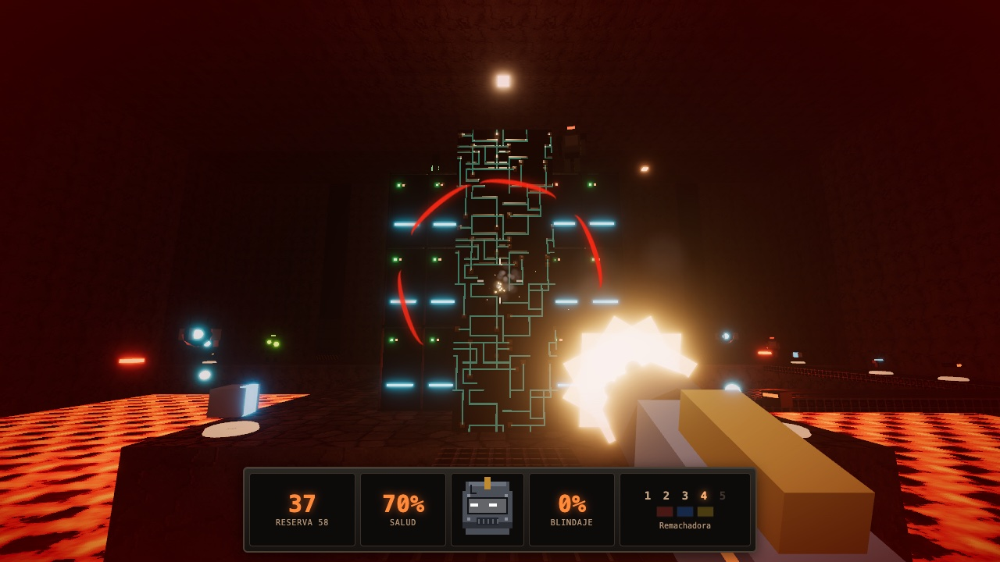
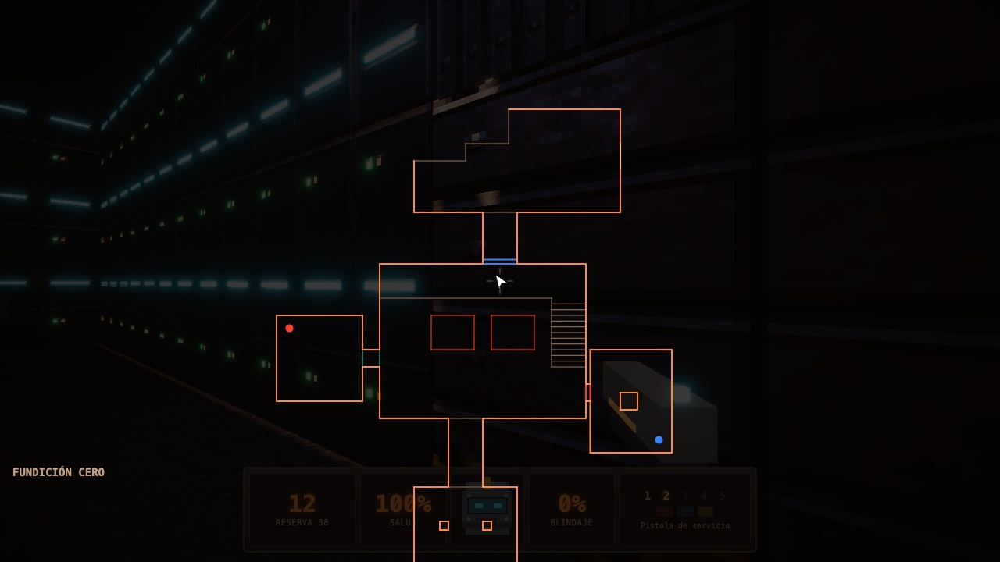
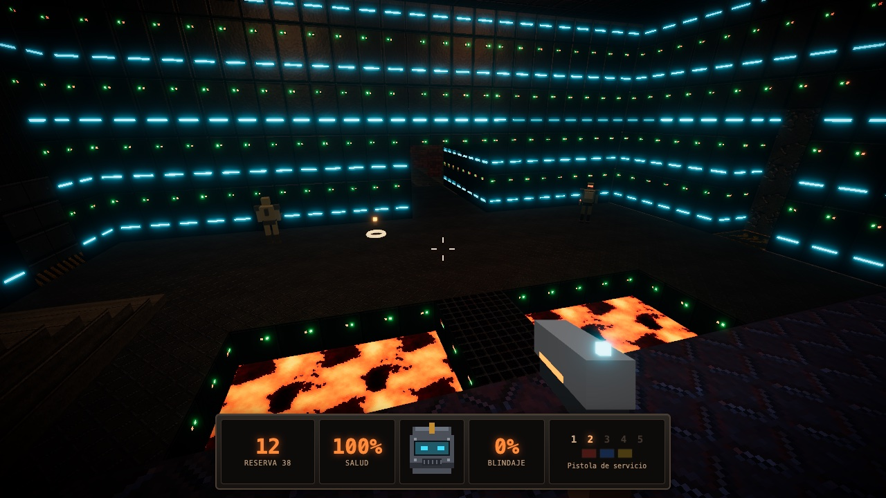
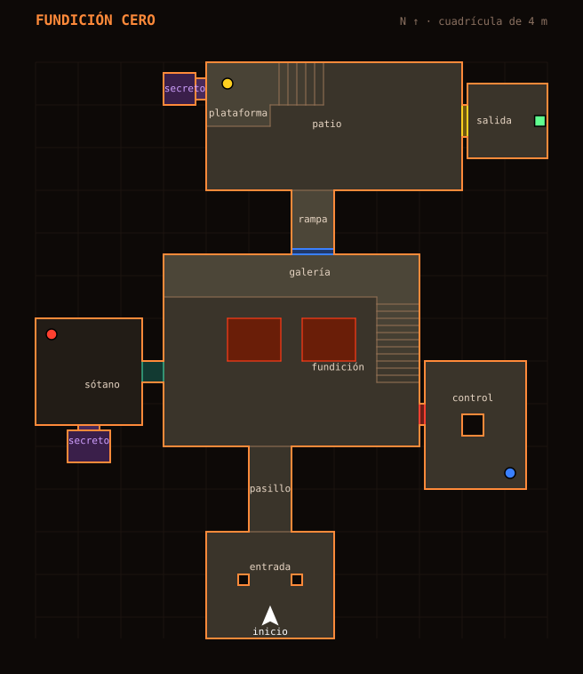
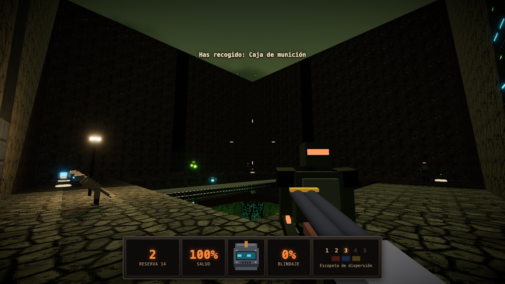
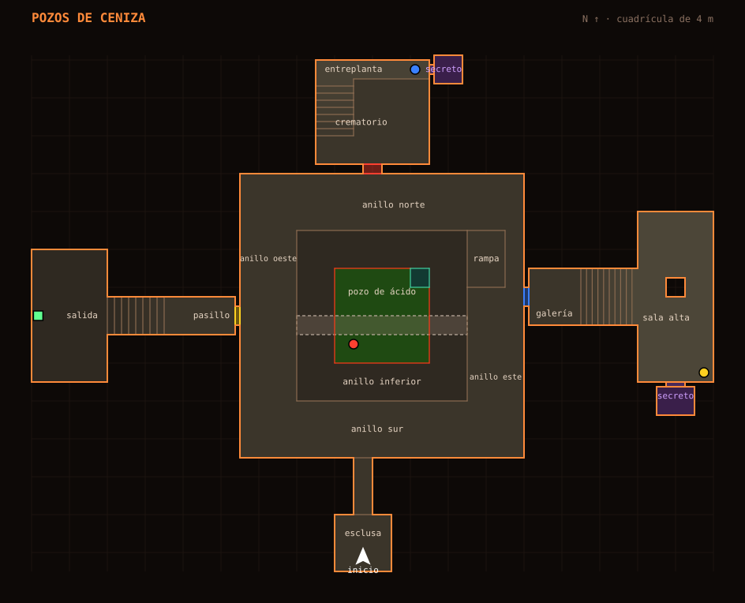
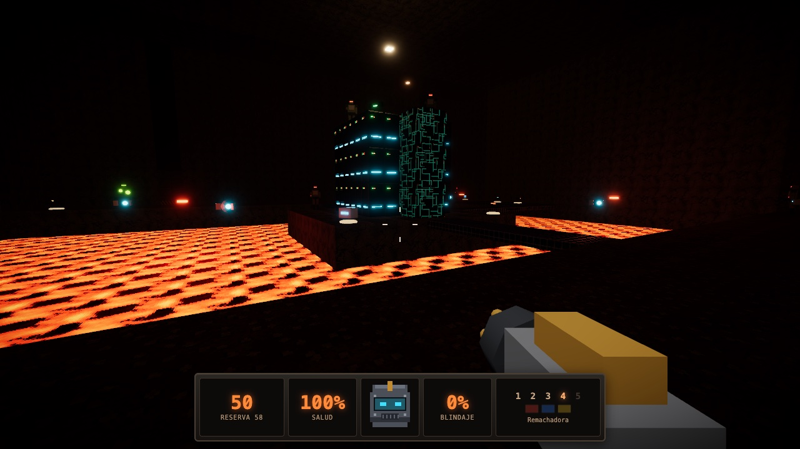
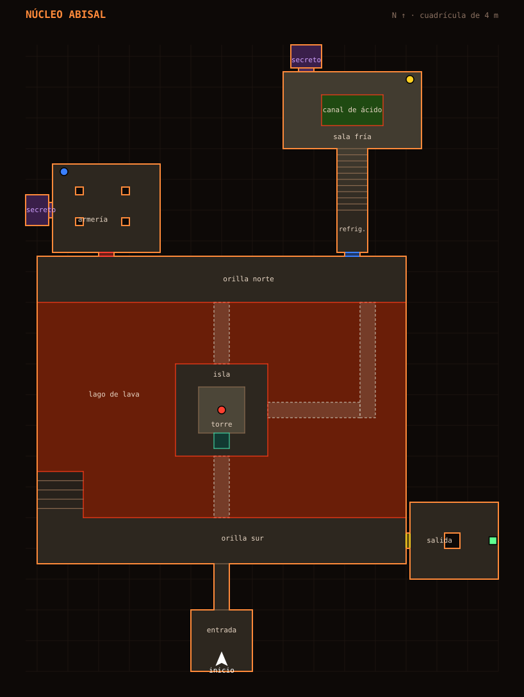

# Cómo jugar a Forja Abisal

Guía para jugadores: cómo empezar, qué hay que hacer, qué te hace daño, qué te ayuda, cómo leer el mapa y qué te espera en cada nivel. Para instalar el juego o conocer cómo está hecho, consulta el [README](README.md).

**Índice:** [Empezar a jugar](#empezar-a-jugar) · [Controles](#controles) · [El objetivo](#el-objetivo) · [Salud, daño y muerte](#salud-daño-y-muerte) · [Premios: objetos, armas y secretos](#premios-objetos-armas-y-secretos) · [Los enemigos](#los-enemigos) · [El automapa](#el-automapa) · [Los niveles](#los-niveles) · [Consejos](#consejos)

## Empezar a jugar

1. Abre el juego: en la [demo del navegador](https://carte1972.github.io/forja-abisal/) o con el lanzador de tu sistema (`jugar.command`, `jugar.bat` o `jugar.sh`).
2. En el menú principal elige **Nueva partida** para empezar la campaña desde el nivel 1, o **Elegir nivel** para ir directamente a uno.
3. Haz **clic** en la pantalla del juego para capturar el ratón y empezar.
4. Pulsa **Esc** en cualquier momento para pausar. Desde la pausa puedes cambiar las opciones, ver los controles, reiniciar el nivel o volver al menú.

Antes de la primera partida, echa un vistazo a **Opciones**: puedes ajustar la sensibilidad del ratón, el campo de visión, el volumen y la calidad gráfica. Los cambios se guardan solos.

## Controles

| Acción                                    | Tecla             |
| ----------------------------------------- | ----------------- |
| Moverse                                   | W A S D / flechas |
| Mirar                                     | Ratón             |
| Saltar                                    | Espacio           |
| Agacharse                                 | C (o Ctrl)        |
| Correr                                    | Shift             |
| Disparar                                  | Clic izquierdo    |
| Disparo alternativo                       | Clic derecho      |
| Cambiar de arma                           | 1-5 / rueda       |
| Recargar                                  | R                 |
| Usar (puertas, ascensores, interruptores) | E                 |
| Automapa                                  | Tab               |
| Panel de rendimiento                      | F3                |
| Pausa                                     | Esc               |

## El objetivo

Cada nivel termina en un **interruptor de salida**: una columna metálica con una pantalla roja. Acércate y pulsa **E**; la pantalla se vuelve verde y el nivel termina.

El camino hasta él está cerrado por puertas de colores:

1. Encuentra la **llave roja** y abre la puerta con franja roja.
2. Detrás está el camino a la **llave azul**, que abre la puerta azul.
3. Detrás de esa, la **llave amarilla**, que abre la puerta amarilla.
4. La puerta amarilla lleva a la salida.

En los tres niveles el orden es siempre rojo → azul → amarillo. Si intentas abrir una puerta sin su llave, verás un aviso. Las llaves que ya tienes aparecen en la barra inferior, a la derecha.

### La campaña

Los tres niveles se juegan seguidos. Todo lo que llevas encima al pulsar la salida (armas, munición, salud y blindaje) pasa al nivel siguiente. Si empiezas un nivel desde **Elegir nivel**, empiezas con el equipo básico de ese nivel.

### La puntuación

Al pulsar la salida verás el resumen del nivel:

| Dato     | Qué mide                                  |
| -------- | ----------------------------------------- |
| Tiempo   | Lo que has tardado en completarlo.        |
| Enemigos | Porcentaje de enemigos eliminados.        |
| Objetos  | Porcentaje de objetos recogidos.          |
| Secretos | Porcentaje de zonas secretas encontradas. |

Para avanzar solo hace falta llegar a la salida. El reto es completar cada nivel al **100 %** en las tres categorías o hacerlo lo más rápido posible.

## Salud, daño y muerte

### Salud y blindaje

- Empiezas con **100 de salud** y **0 de blindaje**.
- El **blindaje absorbe un tercio del daño** que recibes, mientras le quede. El resto se descuenta de la salud.
- La salud puede pasar de 100 (hasta **200**) solo con los viales de suero. El blindaje, hasta 200 con las placas.
- El **casco** del centro de la barra inferior refleja tu estado: el visor cambia de color y se agrieta a medida que pierdes salud, y mira hacia el lado del que te atacan.
- Al recibir daño, la pantalla destella en rojo y un **arco rojo** alrededor del punto de mira señala de dónde viene.

### Qué te hace daño

| Fuente                        | Daño                                                             | Cómo evitarlo                                            |
| ----------------------------- | ---------------------------------------------------------------- | -------------------------------------------------------- |
| Centinela                     | Ráfagas de 3 disparos de 5 puntos, a distancia                   | Ponte a cubierto detrás de columnas y esquinas.          |
| Rastrero                      | Zarpazos de 12 puntos, muy seguidos                              | No dejes que se te acerque; retrocede mientras disparas. |
| Escupidor                     | Bolas de ácido de 18 puntos que caen en parábola                 | Muévete de lado: las bolas tardan en llegar.             |
| Vigía                         | Descargas de energía de 10 puntos                                | Esquiva lateralmente y derríbalo rápido.                 |
| Lava                          | 20 por segundo (Fundición Cero) y 25 por segundo (Núcleo Abisal) | No la pises. Si caes, busca la salida más cercana.       |
| Ácido                         | 15 por segundo                                                   | Cruza lo más rápido posible, mejor con blindaje.         |
| Tus propias cargas explosivas | El 40 % del daño de la explosión, si estás cerca                 | No dispares el lanzacargas a quemarropa.                 |

No hay daño por caída: puedes saltar desde cualquier altura.

### Qué pasa si caes

No hay vidas limitadas. Si tu salud llega a 0, la cámara cae al suelo y aparece la pantalla **«Has caído»**, con dos opciones:

- **Reintentar nivel:** vuelves a empezar el nivel con lo que tenías al entrar en él (armas, munición, salud y blindaje).
- **Salir al menú:** vuelves al menú principal.

Lo que hayas recogido en el intento fallido se pierde. Tampoco se conservan las puertas abiertas ni los enemigos eliminados: el nivel vuelve a empezar entero.

## Premios: objetos, armas y secretos

### Objetos

| Objeto              | Efecto                            |
| ------------------- | --------------------------------- |
| Vial de suero       | +5 de salud, hasta 200            |
| Botiquín            | +25 de salud, hasta 100           |
| Botiquín de campaña | +50 de salud, hasta 100           |
| Placa de blindaje   | +5 de blindaje, hasta 200         |
| Blindaje de forja   | Blindaje a 100                    |
| Caja de munición    | +20 balas (pistola y remachadora) |
| Cartuchos           | +6 cartuchos (escopeta)           |
| Cargas explosivas   | +2 cargas (lanzacargas)           |
| Llaves              | Abren las puertas de su color     |

Si no necesitas un objeto (salud llena, munición al máximo), se queda en el suelo para más tarde. La munición máxima es de 250 balas, 50 cartuchos y 30 cargas.

### Armas

Empiezas siempre con el **martillo** y la **pistola**. Las demás se encuentran por los niveles; al recoger un arma nueva, la sacas al momento.

| Tecla | Arma                   | Munición  | Disparo principal                    | Disparo alternativo                         | Úsala para…                               |
| ----- | ---------------------- | --------- | ------------------------------------ | ------------------------------------------- | ----------------------------------------- |
| 1     | Martillo de pistón     | Ninguna   | Golpe de 30                          | Golpe cargado de 85, con empuje             | Ahorrar munición contra rastreros.        |
| 2     | Pistola de servicio    | Balas     | Tiro preciso de 14 (cargador de 12)  | Ráfaga de tres balas                        | Enemigos lejanos y vigías.                |
| 3     | Escopeta de dispersión | Cartuchos | 8 perdigones de 9                    | Los dos cañones: 18 perdigones de 9         | Rastreros y centinelas a corta distancia. |
| 4     | Remachadora            | Balas     | Ráfaga continua de 10 por remache    | Sobrecargada: más cadencia, menos precisión | Grupos y vigías.                          |
| 5     | Lanzacargas            | Cargas    | Carga de 110 que estalla al impactar | Carga rebotadora con espoleta               | Escupidores y grupos. Daño en área.       |

- Cada arma recarga sola al vaciar el cargador. Con **R** recargas antes.
- Sin munición, el arma hace clic en vacío y cambia sola a otra que tenga balas (nunca al lanzacargas).
- **Salto con carga:** dispara el lanzacargas al suelo justo después de saltar y la explosión te lanzará mucho más alto. Cuesta algo de salud.

### Secretos

Cada nivel esconde **dos zonas secretas** tras paredes que parecen normales pero que se abren con **E**. Dentro hay siempre algo valioso: blindaje, botiquines, munición o incluso un arma antes de tiempo. Cada secreto que encuentres cuenta para el porcentaje final.

Pistas para encontrarlos: prueba a pulsar **E** en las paredes de los rincones sin salida y en los tramos de pared que no encajan con el resto. El automapa no los muestra, pero sí te deja ver huecos sospechosos entre salas.

## Los enemigos

| Enemigo   | Aspecto                                         | Salud | Ataque                               | Consejo                                                                    |
| --------- | ----------------------------------------------- | ----- | ------------------------------------ | -------------------------------------------------------------------------- |
| Centinela | Soldado acorazado con visor rojo                | 60    | Ráfagas de tres disparos a distancia | Se encoge de dolor a menudo: una ráfaga seguida le impide disparar.        |
| Rastrero  | Criatura encorvada de brazos largos, muy rápida | 45    | Zarpazos cuerpo a cuerpo             | Un buen escopetazo de cerca lo tumba. Nunca le des la espalda.             |
| Escupidor | Mole con sacos de ácido brillantes              | 130   | Bolas de ácido en parábola           | Es lento y aguanta mucho: el lanzacargas es tu mejor aliado.               |
| Vigía     | Orbe volador con un ojo y aletas giratorias     | 55    | Descargas de energía                 | Vuela por encima de la lava y del vacío: la remachadora lo derriba rápido. |

- **Te ven** dentro de su cono de visión si nada se interpone, y **te oyen** al disparar (el ruido recorre los pasillos, no atraviesa las paredes). Un disparo puede despertar a toda una sala.
- **Te persiguen:** suben escaleras, rodean obstáculos, abren las puertas normales y van a tu última posición conocida.
- **Se pelean entre ellos:** si un enemigo hiere a otro por accidente, se enfrentarán hasta que uno muera. Ponte entre dos grupos y deja que se disparen.

## El automapa

Pulsa **Tab** para abrir el plano del nivel sobre la partida, y otra vez para cerrarlo. El juego sigue mientras lo miras.

El plano se va **descubriendo al explorar**: muestra las salas por las que has pasado y las que tienen al lado. Siempre está centrado en ti, con el norte hacia arriba.

| En el mapa                   | Significa                                                       |
| ---------------------------- | --------------------------------------------------------------- |
| Flecha blanca                | Tú, apuntando hacia donde miras                                 |
| Líneas naranjas              | Paredes                                                         |
| Líneas marrones finas        | Escalones y cambios de altura                                   |
| Líneas rojas                 | Bordes de lava o ácido                                          |
| Líneas turquesas             | Ascensores                                                      |
| Líneas grises                | Puertas normales                                                |
| Líneas roja, azul o amarilla | Puertas que necesitan esa llave                                 |
| Círculo de color             | Una llave que aún no has cogido (solo en zonas ya descubiertas) |
| Cuadrado verde               | La salida (solo si ya has descubierto su zona)                  |

Las paredes secretas se dibujan como paredes normales: el mapa no las delata.

## Los niveles

Cada nivel tiene tres llaves, dos secretos y una salida. Los planos completos y las rutas están ocultos en un desplegable, por si prefieres descubrirlos tú.

**Leyenda de los planos:** la flecha blanca es el inicio; los círculos de colores, las llaves; el cuadrado verde, la salida; las zonas moradas, los secretos; las rojas, lava; las verdes, ácido; las turquesas, ascensores; los rectángulos discontinuos, puentes y pasarelas por los que se puede pasar por encima y por debajo. Cuanto más claro es el suelo, más alto está.

### Nivel 1 — Fundición Cero

Una fundición abandonada. Desde la sala de entrada, un pasillo lleva a la gran nave de la fundición, cruzada por un **canal de lava** con un puente de rejilla. Al oeste, un ascensor baja a un **sótano** oscuro; al este está la **sala de control**; una escalera sube a una **galería** elevada que da al norte, hacia un **patio a cielo abierto** con una plataforma elevada. La sala de salida está al este del patio.

| Dato                  | Valor                                                    |
| --------------------- | -------------------------------------------------------- |
| Enemigos              | 13: 6 centinelas, 5 rastreros, 1 escupidor, 1 vigía      |
| Objetos               | 22                                                       |
| Armas que encontrarás | Escopeta (en la fundición) y remachadora (en un secreto) |
| Peligros              | Lava (20 por segundo)                                    |
| Equipo inicial        | Martillo, pistola y 50 balas                             |

<strong>Ver plano y ruta (contiene spoilers)</strong>

**Ruta:**

1. Sigue el pasillo hasta la fundición. Nada más entrar, a la derecha, está la **escopeta**.
2. En la pared oeste de la fundición hay un **ascensor**: súbete, pulsa E y bajarás al **sótano**. Allí está la **llave roja**.
3. Vuelve a la fundición y abre la **puerta roja**, en la pared este. Lleva a la **sala de control**, con la **llave azul**.
4. Sube la escalera de la esquina noreste de la fundición hasta la **galería**. En su extremo norte está la **puerta azul**.
5. Baja la rampa al **patio**. Sube la escalera hasta la **plataforma** del noroeste: allí está la **llave amarilla**.
6. Cruza el patio hasta la **puerta amarilla**, en la pared este, y pulsa el interruptor de la sala de salida.

**Secretos:**

- **Sótano:** la pared sur del sótano se abre con E. Dentro hay un **blindaje de forja** y un **botiquín de campaña**.
- **Plataforma del patio:** la pared oeste de la plataforma se abre con E. Dentro está la **remachadora** y una caja de munición.

### Nivel 2 — Pozos de Ceniza

Una enorme **sima a cielo abierto** con tres alturas: un anillo superior que la rodea, un anillo inferior al que se baja por una rampa y, en el fondo, un **pozo de ácido** del que solo se sale en ascensor. Un puente de rejilla cruza la sima de oeste a este. Desde el anillo superior salen tres puertas: al norte, un **crematorio** con entreplanta; al este, una galería que sube a una **sala alta**; al oeste, el camino a la salida.

| Dato                  | Valor                                                    |
| --------------------- | -------------------------------------------------------- |
| Enemigos              | 21: 7 centinelas, 8 rastreros, 3 escupidores, 3 vigías   |
| Objetos               | 29                                                       |
| Armas que encontrarás | Remachadora (anillo norte) y lanzacargas (en un secreto) |
| Peligros              | Ácido (15 por segundo)                                   |
| Equipo inicial        | Martillo, pistola, escopeta, 60 balas y 16 cartuchos     |

<strong>Ver plano y ruta (contiene spoilers)</strong>

**Ruta:**

1. Sal de la esclusa al anillo sur. En el anillo norte está la **remachadora**.
2. La **llave roja** está en el **fondo del pozo de ácido**, justo al sur del puente. Déjate caer, cógela y corre al **ascensor** de la esquina noreste del pozo (pulsa E para llamarlo). Te sube al anillo inferior, y la rampa del este te devuelve al anillo superior.
3. Abre la **puerta roja**, al norte. En el **crematorio**, sube la escalera a la **entreplanta**: allí está la **llave azul**.
4. Abre la **puerta azul**, en el anillo este. La galería sube a la **sala alta**, con la **llave amarilla** en su esquina sureste.
5. Abre la **puerta amarilla**, en el anillo oeste. Un pasillo y una escalera bajan a la sala de salida.

**Secretos:**

- **Entreplanta del crematorio:** la pared este de la entreplanta se abre con E. Dentro está el **lanzacargas**, cargas explosivas y un **blindaje de forja**.
- **Sala alta:** la pared sur de la sala alta se abre con E. Dentro hay un **botiquín de campaña** y dos cajas de **cargas explosivas**.

### Nivel 3 — Núcleo Abisal

El corazón de la forja: una **caverna** gigantesca ocupada por un **lago de lava**, con una isla en el centro coronada por una **torre**. Unas pasarelas de rejilla cruzan el lago de norte a sur y hacia el este. En la orilla norte se abren una **armería** (al oeste) y la **sala de refrigeración** (al este), que sube a una **sala fría** con un canal de ácido. La salida está al este de la orilla sur, y está vigilada.

| Dato                  | Valor                                                              |
| --------------------- | ------------------------------------------------------------------ |
| Enemigos              | 34: 11 centinelas, 11 rastreros, 6 escupidores, 6 vigías           |
| Objetos               | 29                                                                 |
| Armas que encontrarás | Lanzacargas (en la pasarela este del lago)                         |
| Peligros              | Lava (25 por segundo) y ácido (15 por segundo)                     |
| Equipo inicial        | Martillo, pistola, escopeta, remachadora, 120 balas y 24 cartuchos |

<strong>Ver plano y ruta (contiene spoilers)</strong>

**Ruta:**

1. Sal a la orilla sur y cruza la **pasarela sur** hasta la isla.
2. El **ascensor** está en la cara sur de la torre y empieza arriba: pulsa E para que baje, súbete y te llevará a lo alto. Allí están la **llave roja** y un **blindaje de forja**. Cuidado: hay centinelas en la torre.
3. Desde la isla, la pasarela que sale hacia el este lleva al **lanzacargas**. Sigue por ella o por la pasarela norte hasta la **orilla norte**.
4. Abre la **puerta roja**, en el oeste de la orilla norte. En la **armería** está la **llave azul**; es la sala con más rastreros juntos.
5. Abre la **puerta azul**, en el este de la orilla norte. Sube la escalera de la sala de refrigeración hasta la **sala fría**. La **llave amarilla** está en la esquina noreste; rodea el canal de ácido en lugar de cruzarlo.
6. Vuelve a la orilla sur. La **puerta amarilla** está en su extremo este. La sala de salida es una **emboscada**: entra con salud y munición.

Si caes a la lava, la **escalera del suroeste** del lago te devuelve a la orilla sur.

**Secretos:**

- **Armería:** la pared oeste de la armería se abre con E. Dentro hay un **blindaje de forja**, cargas explosivas y un **botiquín de campaña**.
- **Sala fría:** el lado oeste de la pared norte se abre con E. Dentro hay un **blindaje de forja**, un **botiquín de campaña** y munición.

## Consejos

- **Escucha:** cada enemigo tiene su propio grito de alerta. Si oyes uno, te han visto.
- **No dispares por disparar:** el ruido atrae a los enemigos de las salas cercanas. A veces conviene avanzar en silencio con el martillo.
- **Usa las esquinas:** asómate, dispara y vuelve a cubrirte. Los centinelas fallan más a distancia.
- **Recoge con cabeza:** si tienes la salud llena, deja los botiquines para la vuelta.
- **Abre el automapa a menudo:** te dice qué zonas te quedan por explorar y dónde están las llaves que has visto.
- **Busca los secretos:** el blindaje extra de los secretos marca la diferencia en el nivel 3.
