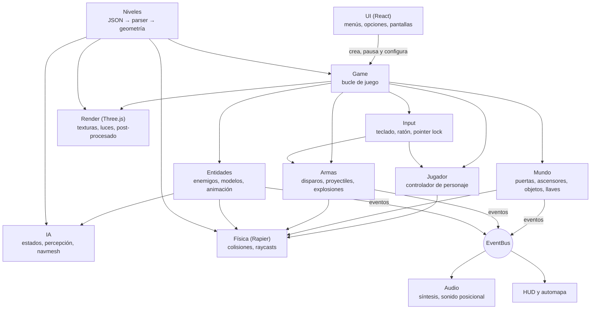

# Forja Abisal

FPS 3D retro para el navegador, hecho con Three.js y Rapier. Tiene el ritmo de los shooters de los 90: niveles laberínticos y verticales, muchos enemigos, llaves y secretos. Todo el contenido (modelos, texturas, sonidos, niveles y nombres) es original y se genera por código.

<!-- CAPTURA: añade aquí una captura o GIF del juego, por ejemplo:  -->

> **Demo:** https://carte1972.github.io/forja-abisal/ (juega en el navegador, sin instalar nada)

**Índice:** [Qué hay que hacer](#qué-hay-que-hacer) · [Funcionalidad](#funcionalidad) · [Controles](#controles) · [Instalación y ejecución](#instalación-y-ejecución) · [Arquitectura](#arquitectura) · [Cómo crear niveles nuevos](#cómo-crear-niveles-nuevos) · [Desarrollo](#desarrollo) · [Créditos y licencia](#créditos-y-licencia)

## Qué hay que hacer

Desciendes por una forja abandonada e infestada, nivel a nivel. En cada nivel tienes que **llegar al interruptor de salida y pulsarlo con E**. Por el camino, las puertas con franja de color te cierran el paso hasta que encuentras su llave.

### La campaña

Tres niveles originales, de dificultad creciente y cada vez más verticales. En cada uno hay que conseguir las **tres llaves** (roja, azul y amarilla) para llegar a la salida, y cada uno esconde al menos **dos secretos**.

| Nivel | Nombre          | Qué te espera                                                                                                                                                                |
| ----- | --------------- | ---------------------------------------------------------------------------------------------------------------------------------------------------------------------------- |
| 1     | Fundición Cero  | Una fundición con un canal de lava, un sótano al que se baja en ascensor, una galería elevada y un patio exterior. 13 enemigos.                                              |
| 2     | Pozos de Ceniza | Una sima a cielo abierto con tres alturas, un pozo de ácido del que solo se sale en ascensor, un puente sobre el vacío, un crematorio y unas galerías elevadas. 21 enemigos. |
| 3     | Núcleo Abisal   | Una caverna con un lago de lava cruzado por pasarelas, una torre en una isla, una armería, una sala fría con un canal de ácido y una emboscada final. 34 enemigos.           |

- **Llaves:** las puertas con franja roja, azul o amarilla solo se abren con la llave de ese color. Si no la tienes, verás un aviso. En el automapa (Tab) aparecen las llaves de las zonas que ya has descubierto.
- **Secretos:** algunas paredes esconden pasadizos que se abren con E. Encontrarlos no es obligatorio, pero cuentan para la puntuación.
- **Entre niveles:** las armas, la munición, la salud y el blindaje pasan al siguiente nivel. Al terminar uno puedes seguir o repetirlo con lo que tenías al entrar.
- **Si caes:** puedes reintentar el nivel con lo que tenías al entrar o volver al menú.

### Puntuación

Al pulsar la salida se muestra el resumen del nivel:

| Dato     | Qué mide                                  |
| -------- | ----------------------------------------- |
| Tiempo   | Lo que has tardado en completar el nivel. |
| Enemigos | Porcentaje de enemigos eliminados.        |
| Objetos  | Porcentaje de objetos recogidos.          |
| Secretos | Porcentaje de zonas secretas encontradas. |

Terminar un nivel basta para avanzar; el reto es hacerlo al **100 %** en las tres categorías, o hacerlo lo más rápido posible.

## Funcionalidad

### Armas

| Tecla | Arma                   | Disparo principal                       | Disparo alternativo                               |
| ----- | ---------------------- | --------------------------------------- | ------------------------------------------------- |
| 1     | Martillo de pistón     | Golpe rápido                            | Golpe cargado, más lento y con empuje             |
| 2     | Pistola de servicio    | Tiro preciso (cargador de 12)           | Ráfaga de tres balas                              |
| 3     | Escopeta de dispersión | 8 perdigones (2 cartuchos)              | Los dos cañones a la vez                          |
| 4     | Remachadora            | Ráfaga continua (cargador de 50)        | Modo sobrecargado: más cadencia y menos precisión |
| 5     | Lanzacargas            | Carga explosiva que estalla al impactar | Carga rebotadora con espoleta                     |

- Cada arma recarga sola al vaciar el cargador. Con R se recarga antes.
- Sin munición, el arma hace clic en vacío y se cambia sola a otra que tenga balas (nunca al lanzacargas).
- Las explosiones empujan: disparar el lanzacargas al suelo justo después de saltar lanza al jugador por los aires (_rocket jump_).

### Enemigos

| Enemigo   | Aspecto                                         | Ataque                               | Salud |
| --------- | ----------------------------------------------- | ------------------------------------ | ----- |
| Centinela | Soldado acorazado con visor rojo                | Ráfagas de tres disparos a distancia | 60    |
| Rastrero  | Criatura encorvada de brazos largos, muy rápida | Zarpazos cuerpo a cuerpo             | 45    |
| Escupidor | Mole con sacos de ácido brillantes              | Bolas de ácido que caen en parábola  | 130   |
| Vigía     | Orbe volador con un ojo y aletas giratorias     | Descargas de energía                 | 55    |

- **Percepción:** los enemigos te ven dentro de su cono de visión si nada se interpone, y oyen los disparos (el ruido viaja por los pasillos, no a través de las paredes).
- **Tras descubrirte:** te persiguen por la malla de navegación: suben escaleras, rodean columnas, abren puertas normales y siguen tu última posición conocida.
- **Si uno hiere a otro, se pelean entre ellos** hasta que uno muere.
- **Al recibir daño** a veces se encogen de dolor, lo que interrumpe su ataque.

### Objetos

| Objeto                                         | Efecto                                                          |
| ---------------------------------------------- | --------------------------------------------------------------- |
| Vial de suero                                  | +5 de salud (permite pasar de 100, hasta 200)                   |
| Botiquín / Botiquín de campaña                 | +25 / +50 de salud (hasta 100)                                  |
| Placa de blindaje                              | +5 de blindaje (hasta 200)                                      |
| Blindaje de forja                              | Blindaje al 100                                                 |
| Caja de munición, cartuchos, cargas explosivas | Munición para cada tipo de arma                                 |
| Escopeta, remachadora, lanzacargas             | El arma, con algo de munición (si es nueva, se saca al momento) |
| Llaves roja, azul y amarilla                   | Abren las puertas de su color                                   |

Los objetos que no necesitas (salud llena, munición al máximo) se quedan en el suelo. El blindaje absorbe un tercio del daño.

### Mecánicas del mundo

- **Puertas:** se abren con E y se cierran solas al cabo de unos segundos. No se cierran si hay alguien debajo.
- **Ascensores:** súbete y pulsa E (o pulsa E desde abajo para que baje). Esperan unos segundos y vuelven.
- **Paredes secretas:** parecen paredes normales, pero se abren con E.
- **Suelos peligrosos:** la lava y el ácido hacen daño mientras los pisas.
- **Escaleras, rampas, puentes y balcones:** los niveles tienen varias alturas; se puede pasar por encima y por debajo de pasarelas.

### HUD

- **Barra inferior:** munición y reserva, salud, icono del jugador, blindaje, armas que llevas (1-5, la actual resaltada) y llaves.
- **Icono del jugador:** un casco cuyo visor cambia de color con la salud y se agrieta. Mira hacia el lado del que te atacan.
- **Avisos visuales:** un arco rojo alrededor del punto de mira indica de dónde llega el daño. La pantalla destella en rojo al recibir daño y del color del objeto al recogerlo.
- **Panel de rendimiento (F3):** FPS, tiempo de frame, draw calls y triángulos.

### Menús y opciones

- **Menú principal:** nueva partida, elegir nivel, opciones y controles. Con `?nivel=2` (o `3`) en la dirección se salta el menú y se entra directamente en ese nivel.
- **Pausa (Esc):** continuar, opciones, controles, reiniciar el nivel o salir al menú.
- **Opciones** (se guardan en el navegador y se aplican al momento, también en plena partida):

| Grupo     | Opción                                                                                         |
| --------- | ---------------------------------------------------------------------------------------------- |
| Controles | Sensibilidad del ratón, invertir eje vertical                                                  |
| Cámara    | Campo de visión (60–100°), balanceo al andar, retroceso al disparar                            |
| Sonido    | Volumen general                                                                                |
| Gráficos  | Sombras, post-procesado (brillo y viñeta), filtro de píxeles, resolución, panel de rendimiento |

- **Resolución:** en pantallas de alta densidad (Retina) empieza al 75 %, que apenas se nota y va mucho más fluido. Si tu equipo va sobrado, súbela al 100 %.

### Automapa

Con **Tab** se abre un plano de las zonas por las que has pasado, con el norte arriba y una flecha que marca tu posición. Muestra paredes, escalones, lava y ácido, puertas (con el color de su llave), ascensores, las llaves que quedan por coger y la salida, pero solo en zonas ya descubiertas. Las paredes secretas no se delatan.

### Sonido

Todos los efectos se sintetizan por código al arrancar (no hay archivos de audio). Los sonidos del mundo son posicionales: se oyen más fuerte cerca y a un lado u otro según de dónde vengan. Cada enemigo tiene su voz de alerta, de dolor y de muerte, y hay un zumbido ambiental de fondo. El navegador no deja sonar nada hasta el primer clic.

## Controles

| Acción                                    | Tecla             |
| ----------------------------------------- | ----------------- |
| Moverse                                   | W A S D / flechas |
| Mirar                                     | Ratón             |
| Saltar                                    | Espacio           |
| Agacharse                                 | C (o Ctrl)        |
| Correr                                    | Shift             |
| Disparar                                  | Clic izquierdo    |
| Disparo alternativo                       | Clic derecho      |
| Cambiar de arma                           | 1-5 / rueda       |
| Recargar                                  | R                 |
| Usar (puertas, ascensores, interruptores) | E                 |
| Automapa                                  | Tab               |
| Panel de rendimiento                      | F3                |
| Pausa                                     | Esc               |

> **¿Por qué C para agacharse?** En los navegadores, Ctrl+W cierra la pestaña y una página web no puede impedirlo. Ctrl también funciona, pero C es más seguro.

## Instalación y ejecución

La forma más sencilla de jugar es la [demo en el navegador](https://carte1972.github.io/forja-abisal/). Para jugar en local, sin conexión, usa el lanzador.

### Opción rápida: doble clic

Descarga el proyecto (botón **Code → Download ZIP** en GitHub, o `git clone`) y haz doble clic en el lanzador de tu sistema:

| Sistema | Lanzador        | Cómo abrirlo                                                                                                          |
| ------- | --------------- | --------------------------------------------------------------------------------------------------------------------- |
| macOS   | `jugar.command` | Doble clic en Finder. La primera vez, clic derecho → **Abrir** (ver [Solución de problemas](#solución-de-problemas)). |
| Windows | `jugar.bat`     | Doble clic en el Explorador.                                                                                          |
| Linux   | `jugar.sh`      | Doble clic ("Ejecutar" o "Ejecutar en terminal") o `./jugar.sh` desde una terminal.                                   |

El lanzador hace todo lo necesario, y solo lo que haga falta:

1. **Node.js:** si tu equipo tiene Node.js 22.12 o superior, lo usa. Si no lo tiene (o es más antiguo), **descarga una copia de Node.js LTS** desde nodejs.org en la carpeta `.forja_node/` del juego, tras comprobar su suma SHA-256. No necesita permisos de administrador ni toca nada fuera de la carpeta del juego, y no interfiere con otras versiones de Node.js. Para quitarla, basta con borrar la carpeta.
2. **Dependencias:** ejecuta `npm install` solo si faltan o si `package-lock.json` ha cambiado.
3. **Compilación:** hace el build de producción solo si no existe o si el código ha cambiado.
4. **Juego:** lo sirve en local en un puerto libre (desde el 4173) y abre tu navegador. En la terminal verás la URL. Para cerrar el juego, pulsa **Ctrl+C** o cierra la ventana.

La primera vez necesita conexión a internet (para descargar las dependencias y, si hace falta, Node.js) y tarda uno o dos minutos. Las siguientes arranca en segundos y sin conexión.

**Requisitos:** macOS 11 o posterior, Windows 10 u 11 (64 bits), o Linux de 64 bits (x64 o ARM) con glibc 2.28 o posterior. Un navegador moderno con WebGL 2 (Chrome, Edge, Firefox o Safari).

### Opción manual

Requisitos: [Node.js](https://nodejs.org/es/download) **22.12 o superior** (se recomienda la versión LTS).

```bash
npm install
npm run dev       # servidor de desarrollo en http://localhost:5173
npm run build     # build de producción en dist/
npm run preview   # sirve dist/ en local
```

### Solución de problemas

- **macOS dice que no puede abrir `jugar.command` porque es de un desarrollador no identificado.** La primera vez, haz clic derecho sobre el archivo → **Abrir** → **Abrir**. A partir de ahí, el doble clic funciona. Si no aparece la opción, ve a Ajustes del Sistema → Privacidad y seguridad → **Abrir igualmente**.
- **Windows muestra "Windows protegió su PC".** Pulsa **Más información** → **Ejecutar de todas formas**.
- **Linux no ejecuta `jugar.sh` con doble clic.** Si descargaste el ZIP, puede haber perdido el permiso de ejecución: abre una terminal en la carpeta y ejecuta `chmod +x jugar.sh && ./jugar.sh`. Algunos gestores de archivos abren los scripts en el editor; en sus preferencias se puede elegir "Ejecutar".
- **"No se ha podido preparar Node.js automáticamente".** El lanzador no ha podido descargar Node.js (sin conexión, un proxy o un sistema no compatible). Comprueba la conexión y vuelve a abrirlo, o instala la versión LTS desde [nodejs.org](https://nodejs.org/es/download).
- **Puerto ocupado.** El lanzador busca solo un puerto libre a partir del 4173. Con `npm run dev`, si el 5173 está ocupado, Vite usa el siguiente y lo indica en la terminal.
- **El ratón no queda capturado.** Haz clic dentro del juego. Si acabas de pulsar Esc, espera un segundo antes de volver a hacer clic: el navegador impone esa pausa.
- **Va a tirones.** En Opciones → Gráficos baja la resolución o desactiva las sombras y el post-procesado. Con F3 ves los FPS.
- **No suena nada.** El navegador no permite sonido hasta que haces clic en la página. Comprueba también el volumen en Opciones.

## Arquitectura

### Sistemas



- **Motor (`src/engine/`)** y **juego (`src/game/`)** están separados: el motor no sabe nada de armas ni enemigos.
- **La lógica del juego es pura** siempre que se puede (movimiento, armas, IA, puertas, objetos, estadísticas, síntesis de sonido, generación de geometría): funciones sin Three.js ni DOM, con tests en Node.
- **Los sistemas se comunican por eventos** (`EventBus`): un disparo emite `noise` (lo oyen los enemigos) y `sound` (lo reproduce el audio); una recogida emite `pickup` (lo cuentan las estadísticas y lo muestra el HUD).
- **React solo pinta los menús.** El HUD del juego es DOM directo, que solo se reescribe cuando cambia algo.

### Game loop

El bucle (`engine/core/game_loop.ts`) usa `requestAnimationFrame` con un **paso fijo de 60 Hz**:

1. **Acumulador:** el tiempo real de cada frame se suma a un acumulador (máximo 0,25 s, para no entrar en espiral si la pestaña se congela) y se ejecutan tantos pasos de 1/60 s como quepan, hasta 8 por frame.
2. **Paso fijo (`fixedUpdate`), siempre en este orden:**
   1. Mundo: puertas y ascensores (que arrastran al jugador si está encima), objetos, secretos y daño del suelo.
   2. Jugador: movimiento con el controlador de personaje.
   3. Uso (E) y armas.
   4. Enemigos: percepción, IA, caminos y ataques.
   5. `physics.step()` de Rapier: proyectiles y colisiones.
3. **Render (cada frame):** la vista del ratón se aplica aquí, sin esperar al siguiente paso, para que responda al instante. La cámara y los enemigos se **interpolan** entre los dos últimos pasos, así el movimiento es suave a cualquier tasa de refresco. Después se actualizan luces, partículas, HUD y automapa y se dibuja con el post-procesado.

La simulación es igual en un monitor de 60 Hz que en uno de 144 Hz, y la física no depende de los FPS.

### Flujo de carga de un nivel

1. `ui/campaign.ts` elige el nivel (el siguiente de la campaña o el de `?nivel=N`) de la lista `src/levels/index.ts`.
2. `Game.create` inicializa en paralelo los módulos WebAssembly de Rapier (física) y Recast (navegación).
3. `parseLevel` valida el JSON y lo normaliza (sentido de los polígonos, valores por defecto). Si hay errores, los muestra todos juntos.
4. `buildLevelGeometry` genera la geometría de sectores y losas (ver abajo), y `buildLevel` crea con ella las mallas de Three.js, la malla de colisión de Rapier y los cuerpos cinemáticos de puertas y ascensores. Las texturas se generan en canvas al vuelo (`ProceduralMaterials`).
5. Con la geometría de colisión se construye la **navmesh** de los enemigos.
6. Se colocan las cosas del nivel: jugador (con el inventario del nivel anterior), lámparas, enemigos, objetos y salida. Se crean el HUD, el automapa y el audio.
7. El juego queda en estado `ready` y espera el clic para capturar el ratón.

### Generador de geometría por sectores

Un nivel es una lista de **vértices 2D** y de **sectores**: polígonos que los referencian, cada uno con altura de suelo y de techo. A partir de ahí, `engine/level/sector_geometry.ts` (código puro, con tests) genera todo:

- **Contigüidad:** dos sectores son vecinos si comparten una arista (los mismos dos índices de vértice). Por eso se rechazan las uniones en T.
- **Paredes:** una arista sin vecino es una pared completa. Entre vecinos se crea un **escalón** (del suelo bajo al alto) y un **dintel** (del techo alto al bajo). Entre dos zonas a cielo abierto no hay dintel.
- **Suelos y techos:** se triangulan con una triangulación de Delaunay restringida sobre una rejilla de 2 m. Evita triángulos largos y finos, que algunas GPU no dibujan bien. Admiten huecos (columnas, fosos) y rampas.
- **Losas:** prismas sólidos flotantes (puentes, balcones) con cara superior, inferior y laterales.
- **Puertas y ascensores:** prismas convexos aparte, con un cuerpo cinemático que sube y baja.
- **Texturas y luz:** coordenadas UV en el espacio del mundo (una textura cada 2 m, sin costuras entre sectores) y la luz de cada sector en el color de los vértices.
- **Colisiones:** la geometría estática se une en una sola malla triangular de Rapier.

### Carpetas

```text
├── jugar.command, jugar.bat, jugar.sh   Lanzadores de doble clic (macOS, Windows, Linux)
├── scripts/
│   ├── launcher.mjs                     Lógica común de los lanzadores (instalar, compilar, servir)
│   ├── check_node.cjs                   Comprueba la versión de Node.js contra package.json
│   ├── node_portable.sh / .ps1          Descarga Node.js si falta (macOS y Linux / Windows)
│   ├── build_levels.ts                  Genera los JSON de la campaña (npm run levels)
│   └── levels/                          Fuentes de los niveles y kit de autoría (level_kit.ts)
├── src/
│   ├── main.tsx                         Punto de entrada
│   ├── engine/                          Motor, independiente del juego
│   │   ├── core/                        Bucle, paso fijo, eventos, aleatoriedad, utilidades
│   │   ├── render/                      Renderer, post-procesado, luces, cielo, partículas, marcas
│   │   ├── textures/                    Texturas procedurales, ruido y normal maps
│   │   ├── physics/                     Mundo de Rapier, controlador de personaje, grupos de colisión
│   │   ├── level/                       Parser, generador de geometría, triangulación y construcción
│   │   ├── ai/                          Navmesh y búsqueda de caminos
│   │   ├── audio/                       Síntesis de sonidos y audio posicional
│   │   └── input/                       Teclado, ratón, pointer lock y asignación de teclas
│   ├── game/                            El juego
│   │   ├── game.ts                      Crea y une todos los sistemas
│   │   ├── player/                      Movimiento, cámara y salud del jugador
│   │   ├── weapons/                     Armas, proyectiles y modelos en primera persona
│   │   ├── enemies/                     Enemigos: datos, modelos, IA y percepción
│   │   ├── world/                       Puertas, ascensores, objetos, llaves y salida
│   │   └── rules/                       Daño, salud y estadísticas del nivel
│   ├── hud/                             HUD, punto de mira, panel F3 y automapa
│   ├── ui/                              Menús y pantallas (React), ajustes y campaña
│   ├── levels/                          Niveles en JSON y tests de jugabilidad
│   └── types/                           Tipos de librerías que no los traen
├── public/                              Archivos estáticos
└── .github/workflows/                   CI (lint, formato, tipos, tests) y despliegue en GitHub Pages
```

## Cómo crear niveles nuevos

Cada nivel es un archivo JSON en `src/levels/`. Está formado por **sectores**: polígonos 2D con altura de suelo y de techo. El juego extruye las paredes entre sectores, crea los escalones cuando las alturas son distintas, triangula suelos y techos y genera las colisiones.

Los tres niveles de la campaña no se escriben a mano: se generan con un pequeño **kit de autoría** en `scripts/levels/`. Permite describir salas, escaleras y puertas con coordenadas, y reparte solo los vértices compartidos y parte las uniones en T. Tras editar un nivel, ejecuta:

```bash
npm run levels
```

Esto regenera `src/levels/level_0N.json`. Los tests comprueban con un recorrido del grafo de sectores que cada nivel se puede completar:

- Las llaves se consiguen en orden.
- La salida exige las tres llaves.
- Los secretos, los objetos y los enemigos están en zonas alcanzables.

### Coordenadas

- En metros. `x` crece hacia el este y `z` hacia el **sur**; el norte es `-z`. `y` es la altura.
- Los ángulos van en grados: `0` mira al norte y `90` al oeste (sentido antihorario visto desde arriba).

### Ejemplo mínimo

Dos salas unidas por un escalón de 50 cm:

```json
{
  "version": 1,
  "name": "Mi nivel",
  "vertices": [
    [0, 0],
    [8, 0],
    [8, 8],
    [0, 8],
    [14, 0],
    [14, 8]
  ],
  "sectors": [
    {
      "vertices": [0, 1, 2, 3],
      "floor": { "height": 0, "texture": "stone_floor" },
      "ceiling": { "height": 4, "texture": "metal_ceiling" },
      "walls": "brick",
      "light": 0.8
    },
    {
      "vertices": [1, 4, 5, 2],
      "floor": { "height": 0.5, "texture": "metal_floor" },
      "ceiling": { "height": 4, "texture": "metal_ceiling" },
      "walls": "tech_wall"
    }
  ],
  "things": [{ "type": "player_start", "x": 4, "z": 6, "angle": 0 }]
}
```

> Los dos sectores comparten la arista entre los vértices 1 y 2. **Las aristas compartidas deben usar los mismos índices de vértice**: así es como el generador sabe que dos sectores están conectados.

### Campos del nivel

| Campo         | Tipo              | Descripción                                                 |
| ------------- | ----------------- | ----------------------------------------------------------- |
| `version`     | número            | Siempre `1`.                                                |
| `name`        | texto             | Nombre del nivel.                                           |
| `vertices`    | lista de `[x, z]` | Todos los vértices del nivel; se referencian por su índice. |
| `sectors`     | lista             | Los sectores (ver abajo).                                   |
| `slabs`       | lista (opcional)  | Losas: plataformas sólidas flotantes (ver abajo).           |
| `environment` | objeto (opcional) | Niebla, cielo, luz ambiental y sol (ver abajo).             |
| `things`      | lista             | Jugador, lámparas, enemigos, objetos y salida.              |

### Campos de un sector

| Campo      | Tipo                                                    | Descripción                                                                                                                                     |
| ---------- | ------------------------------------------------------- | ----------------------------------------------------------------------------------------------------------------------------------------------- |
| `vertices` | lista de índices                                        | Contorno del sector, en cualquier sentido (se normaliza). Mínimo 3, sin cortes.                                                                 |
| `holes`    | lista de listas (opcional)                              | Huecos dentro del sector: columnas macizas, o el contorno de otro sector interior (por ejemplo, un foso).                                       |
| `floor`    | `{ height, texture, slope? }`                           | Suelo. `slope` lo convierte en rampa: `{ "from": [x, z], "to": [x, z], "toHeight": h }`. El suelo mide `height` en `from` y `toHeight` en `to`. |
| `ceiling`  | `{ height, texture, slope? }` o `{ height, sky: true }` | Techo. Con `sky: true` no hay techo y se ve el cielo; `height` marca hasta dónde suben las paredes exteriores.                                  |
| `walls`    | texto o `{ middle, upper?, lower? }`                    | Textura de las paredes. `lower` se usa en los escalones que suben hacia este sector y `upper` en los dinteles que cuelgan de su techo.          |
| `light`    | número 0–1 (opcional, 0,8)                              | Nivel de luz del sector.                                                                                                                        |
| `secret`   | booleano (opcional)                                     | Zona secreta: cuenta para el % de secretos al entrar.                                                                                           |
| `special`  | objeto (opcional)                                       | Comportamiento especial (ver abajo).                                                                                                            |
| `id`       | texto (opcional)                                        | Nombre para identificar el sector.                                                                                                              |

### Sectores especiales (`special`)

| `type`   | Campos                                                                         | Comportamiento                                                                                                                                                                                                         |
| -------- | ------------------------------------------------------------------------------ | ---------------------------------------------------------------------------------------------------------------------------------------------------------------------------------------------------------------------- |
| `damage` | `damagePerSecond`                                                              | Suelo que hace daño (lava, ácido).                                                                                                                                                                                     |
| `door`   | `key?` (`red`, `blue`, `yellow`), `speed?`, `waitTime?`, `texture?`, `hidden?` | Puerta que sube. El `ceiling.height` del sector es la altura abierta; empieza cerrada. `waitTime` son los segundos que tarda en cerrarse sola (0 = no se cierra). `hidden: true` la disfraza de pared (pared secreta). |
| `lift`   | `lowHeight`, `speed?`, `waitTime?`, `texture?`                                 | Ascensor: el suelo está arriba (`floor.height`) y baja hasta `lowHeight`.                                                                                                                                              |

Las puertas y los ascensores deben ser polígonos **convexos**, sin huecos y con suelo y techo planos.

### Losas (`slabs`)

Una losa es un bloque sólido flotante: permite pasar por encima y por debajo, como en un puente o un balcón.

| Campo      | Tipo                            | Descripción                                               |
| ---------- | ------------------------------- | --------------------------------------------------------- |
| `vertices` | lista de índices                | Contorno de la losa.                                      |
| `bottom`   | número                          | Altura de la cara inferior.                               |
| `top`      | número                          | Altura de la cara superior.                               |
| `texture`  | texto o `{ top, bottom, side }` | Texturas.                                                 |
| `light`    | número (opcional)               | Si no se indica, se usa la luz del sector en el que está. |

### Cosas (`things`)

| Campo    | Tipo              | Descripción                                                                                                                                                    |
| -------- | ----------------- | -------------------------------------------------------------------------------------------------------------------------------------------------------------- |
| `type`   | texto             | `player_start` (obligatorio y único), `lamp` (lámpara), `enemy` (enemigo), `pickup` (objeto), `exit` (interruptor de salida) o `model` (modelo glTF opcional). |
| `x`, `z` | número            | Posición. Debe estar dentro de un sector.                                                                                                                      |
| `y`      | número (opcional) | Altura; por defecto, la del suelo del sector.                                                                                                                  |
| `angle`  | grados (opcional) | Orientación.                                                                                                                                                   |

El resto de campos se guardan como propiedades. Por ejemplo, un `model` usa `url` (ruta dentro de `public/`, por ejemplo `models/estatua.glb`) y `scale`.

El `player_start` admite el inventario inicial: `"weapons": ["pistol", "shotgun", "riveter", "launcher"]` (el martillo va siempre) y `"ammo": { "bullets": 50, "shells": 10, "charges": 4 }`. Si no se indica, se empieza con martillo, pistola y 50 balas.

#### Objetos (`"type": "pickup"`)

`item` es uno de: `health_small`, `health`, `health_large`, `armor_small`, `armor`, `ammo_bullets`, `ammo_shells`, `ammo_charges`, `weapon_shotgun`, `weapon_riveter`, `weapon_launcher`, `key_red`, `key_blue` o `key_yellow`. Con `y` se puede colocar encima de una losa.

Ejemplo: `{ "type": "pickup", "item": "key_red", "x": 7.25, "z": -9.5, "y": 2 }`

#### Salida (`"type": "exit"`)

Interruptor que termina el nivel al pulsarlo con E. `angle` indica hacia dónde mira su pantalla. Todo nivel necesita al menos uno.

#### Enemigos (`"type": "enemy"`)

| Campo    | Tipo                         | Descripción                                                                                                      |
| -------- | ---------------------------- | ---------------------------------------------------------------------------------------------------------------- |
| `kind`   | texto                        | `sentinel` (centinela), `crawler` (rastrero), `spitter` (escupidor) o `watcher` (vigía, volador).                |
| `angle`  | grados                       | Hacia dónde mira al empezar (solo ve dentro de su cono de visión).                                               |
| `patrol` | lista de `[x, z]` (opcional) | Puntos de patrulla: el enemigo va y viene entre su posición inicial y estos puntos. Sin patrulla, espera quieto. |

Ejemplo: `{ "type": "enemy", "kind": "sentinel", "x": 3, "z": 1.5, "angle": 180, "patrol": [[13, 1.5]] }`

#### Lámparas (`"type": "lamp"`)

Por defecto, una lámpara cuelga del techo de su sector. En zonas con cielo se coloca sobre una farola de 3 m. Con `y` se fija su altura exacta.

| Campo       | Tipo        | Por defecto | Descripción                                                                                                        |
| ----------- | ----------- | ----------- | ------------------------------------------------------------------------------------------------------------------ |
| `color`     | `"#rrggbb"` | `#ffd8a8`   | Color de la luz y de la pantalla.                                                                                  |
| `intensity` | número      | `1`         | Intensidad relativa.                                                                                               |
| `radius`    | número      | `10`        | Alcance en metros.                                                                                                 |
| `flicker`   | texto       | `steady`    | `steady` (fija), `flicker` (tiembla), `pulse` (late), `strobe` (intermitente) o `broken` (averiada, con apagones). |
| `shadows`   | booleano    | `false`     | Proyecta sombras. Resérvalo para las luces principales: solo una lámpara a la vez puede tener sombra real.         |

Solo las 6 lámparas más cercanas a la cámara iluminan de verdad. Las demás se siguen viendo encendidas por su pantalla brillante.

### Entorno (`environment`)

Todos los campos son opcionales. Los colores van en formato `"#rrggbb"`.

| Campo                                  | Por defecto      | Descripción                                                                                                                                                                        |
| -------------------------------------- | ---------------- | ---------------------------------------------------------------------------------------------------------------------------------------------------------------------------------- |
| `fog.color`                            | `#1b1512`        | Color de la niebla y del fondo.                                                                                                                                                    |
| `fog.near`, `fog.far`                  | `14`, `75`       | Distancia (m) a la que empieza la niebla y a la que ya lo tapa todo.                                                                                                               |
| `sky.top`, `sky.horizon`, `sky.bottom` | tonos de brasa   | Degradado del cielo procedural.                                                                                                                                                    |
| `sky.clouds`                           | `0.55`           | Nubosidad, de 0 (despejado) a 1 (cubierto).                                                                                                                                        |
| `ambient.color`, `ambient.intensity`   | `#c8b8ac`, `0.9` | Luz ambiental base. Se multiplica por la `light` de cada sector.                                                                                                                   |
| `sun`                                  | sol cálido       | `{ "color", "intensity", "direction": [x, y, z] }` o `null` para no tener sol. Solo existe si el nivel tiene sectores con cielo. Proyecta sombras, así que no entra en interiores. |

### Texturas disponibles

Todas se generan por código al arrancar. Un nombre desconocido se muestra con un damero magenta (`missing`) y un aviso en la consola.

`brick`, `stone_floor`, `stone_step`, `metal_floor`, `metal_ceiling`, `metal_grate`, `tech_wall` (con tiras luminosas), `tech_panel` (circuitos), `door_metal`, `door_frame`, `lift_top`, `rock`, `dirt`, `lava` y `acid` (emisivas y animadas).

Cada textura mide 64×64 píxeles y cubre 2×2 metros. La de las puertas visibles se ajusta al tamaño de la hoja.

### Errores

Al cargar, el nivel se valida y los errores se muestran todos juntos, con la ruta del campo afectado. Se comprueba, entre otras cosas:

- Que los índices de vértice existen.
- Que los polígonos no se cortan.
- Que no hay **uniones en T**: un vértice apoyado en mitad de la arista de otro sector. Hay que añadir ese vértice también al otro sector.
- Que ningún sector se solapa con otro.
- Que el techo queda por encima del suelo.
- Que hay exactamente un `player_start`.

### Añadir el nivel al juego

1. Guarda el JSON en `src/levels/` (por ejemplo, `src/levels/mi_nivel.json`).
2. Impórtalo en `src/levels/index.ts` y añádelo a la lista `LEVELS`, en la posición en la que quieras jugarlo.
3. Pruébalo con `npm run dev` abriendo `http://localhost:5173/?nivel=N`, donde `N` es su posición en la lista. También aparecerá en "Elegir nivel", y los tests comprobarán que se puede completar.

## Desarrollo

| Script               | Qué hace                                          |
| -------------------- | ------------------------------------------------- |
| `npm run dev`        | Servidor de desarrollo con recarga en caliente    |
| `npm run build`      | Typecheck + build de producción en `dist/`        |
| `npm run preview`    | Sirve el build de producción                      |
| `npm test`           | Ejecuta los tests (Vitest)                        |
| `npm run test:watch` | Tests en modo observación                         |
| `npm run lint`       | ESLint                                            |
| `npm run format`     | Formatea el código con Prettier                   |
| `npm run typecheck`  | Comprobación de tipos de TypeScript               |
| `npm run levels`     | Regenera los niveles JSON desde `scripts/levels/` |

### Tests

Los tests (Vitest) están junto al código, como `*.test.ts`, y se ejecutan en Node. Cubren la lógica pura: movimiento, armas, IA, percepción, daño, puertas y ascensores, objetos, estadísticas, síntesis de sonido, texturas, parser y generador de geometría, además de la jugabilidad de cada nivel (llaves, salida y secretos alcanzables).

```bash
npm test                                              # todos
npx vitest run src/game/weapons/weapon_logic.test.ts  # un archivo
npx vitest run -t "puertas"                           # por nombre
```

### Convenciones

- TypeScript estricto, ESLint y Prettier. Nombres de archivo en `snake_case`.
- Los commits siguen [Conventional Commits](https://www.conventionalcommits.org/es/v1.0.0/) en español (`feat:`, `fix:`, `refactor:`, `test:`, `docs:`, `chore:`).
- La CI ejecuta lint, formato, typecheck y tests en cada push y pull request. Cada push a `main` se despliega en GitHub Pages.
- En desarrollo, `window.__forja` da acceso al juego desde la consola. Por ejemplo, `__forja.debugState()` muestra la posición y la velocidad del jugador, y `__forja.debugSetPlaying(true)` entra en modo juego sin capturar el ratón (útil para pruebas automatizadas).

### Cómo contribuir

1. Haz un fork y crea una rama para tu cambio.
2. Antes de abrir el pull request, comprueba que todo pasa:

   ```bash
   npm run lint && npm run format:check && npm run typecheck && npm test
   ```

3. Si el cambio se ve en el juego, pruébalo con `npm run dev`.
4. Abre el pull request explicando qué cambia y por qué.

**Todo el contenido debe ser original:** no se aceptan modelos, texturas, sonidos, nombres ni niveles de otros juegos. Las texturas y los sonidos se generan por código.

## Créditos y licencia

Todo el contenido del juego es original y se genera por código: modelos, texturas, sonidos, niveles y nombres. No se usan assets, nombres ni niveles de otros juegos.

Hecho con [Three.js](https://threejs.org/), [Rapier](https://rapier.rs/), [recast-navigation-js](https://github.com/isaac-mason/recast-navigation-js), [postprocessing](https://github.com/pmndrs/postprocessing), [React](https://react.dev/) y [Vite](https://vite.dev/), cada uno con su propia licencia.

Publicado bajo licencia [MIT](LICENSE).
