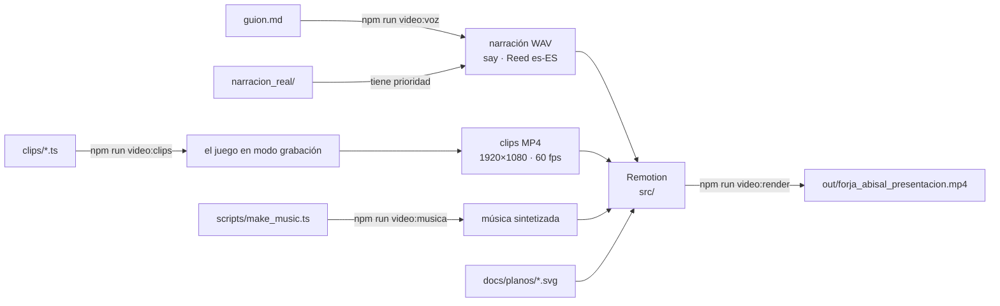

# Vídeo de presentación de Forja Abisal

Vídeo de unos 2 minutos y medio que cuenta la historia del juego («Lo que arde abajo») y enseña, con imágenes reales, los controles, las armas, los enemigos, los tres niveles con sus planos y los trucos. Todo se genera por código dentro de este repositorio: el propio juego graba sus clips y [Remotion](https://www.remotion.dev/) monta el vídeo.

El guion está en [`guion.md`](guion.md) y la especificación del trabajo, en [`../especificacion_video.md`](../especificacion_video.md).

## Cómo funciona



1. **Clips.** El juego tiene un modo de grabación (`?grabar=<clip>`, solo en desarrollo). Cada clip de [`clips/`](clips/) indica nivel, cámara, acciones y duración. El script abre el juego en Chrome y lo avanza **un paso de simulación de 1/60 s por fotograma**, sin reloj real. Captura cada fotograma y lo codifica con el ffmpeg de Remotion. El resultado es siempre el mismo: dos grabaciones del mismo clip dan el mismo MP4, byte a byte.
2. **Narración.** El texto de cada escena sale del guion y se genera con la voz de macOS de [`voz.config.json`](voz.config.json).
3. **Música.** Un bucle de fondo y un golpe metálico, sintetizados por código, sin muestras de terceros.
4. **Montaje.** Remotion junta clips, narración, música, textos animados y los planos de los niveles. **Cada escena dura lo que su narración**, más un pequeño margen, así que el vídeo se reajusta solo si cambia la voz.
5. **Render.** El MP4 final sale en H.264, 1920×1080, 60 fps, con audio AAC.
6. **Versión web.** Una copia ligera (1080p a 30 fps) para el botón «Ver tráiler» del menú del juego.

## Requisitos

- Las dependencias del juego (`npm install` en la raíz) y las del vídeo: `npm install --prefix video`.
- **macOS** con la voz _Reed (Español (España))_ para la narración provisional. En otro sistema, deja grabaciones propias en `narracion_real/`.
- **Google Chrome** instalado. Se usa para grabar los clips y para renderizar. Si Playwright ya tiene su Chrome sin interfaz en el equipo, Remotion usa ese; con `REMOTION_BROWSER` puedes indicar otro. No se descarga ningún navegador.

## Comandos

Todos se ejecutan desde la raíz del repositorio.

| Comando                            | Qué hace                                                                               | Tiempo aproximado |
| ---------------------------------- | -------------------------------------------------------------------------------------- | ----------------- |
| `npm run video`                    | Todo seguido: clips, narración, música, render y versión web                           | 10-15 min         |
| `npm run video:clips`              | Graba los 24 clips en `public/clips/`                                                  | 6 min             |
| `npm run video:clips -- <clip> …`  | Graba solo los clips indicados                                                         |                   |
| `npm run video:clips -- --vista …` | Guarda solo tres fotogramas por clip (inicio, mitad y final) en `public/clips/vistas/` | segundos          |
| `npm run video:voz`                | Genera la narración en `public/narracion/` a partir del guion                          | 30 s              |
| `npm run video:musica`             | Sintetiza la música en `public/musica/`                                                | 2 s               |
| `npm run video:studio`             | Abre Remotion Studio para previsualizar y ajustar                                      |                   |
| `npm run video:render`             | Renderiza `out/forja_abisal_presentacion.mp4`                                          | 6 min             |
| `npm run video:web`                | Versión web para el botón «Ver tráiler» del juego (`public/trailer/` de la raíz)       | 1 min             |
| `npm run video:typecheck`          | Comprueba los tipos del proyecto de vídeo                                              |                   |

Los clips, audios y el MP4 **no se suben al repositorio**. Se regeneran con estos comandos. La única excepción es la versión web del tráiler (`public/trailer/forja_abisal_trailer.mp4`, 1080p a 30 fps, unos 29 MB, con su portada): el menú principal del juego la reproduce con el botón «Ver tráiler» y tiene que estar en el repositorio para que funcione en GitHub Pages. Si regeneras el vídeo, `npm run video` la actualiza al final.

## Editar el guion y regenerar el vídeo

1. Cambia la narración de una escena en [`guion.md`](guion.md). Es el texto de las líneas que empiezan por `>` en el bloque «Narración». Escríbelo para leer en voz alta: frases cortas, sin paréntesis ni siglas. Los puntos suspensivos hacen una pausa.
2. `npm run video:voz` regenera los audios.
3. `npm run video:render` renderiza el vídeo. Las escenas se alargan o acortan solas según la nueva narración.

Los cortes y los rótulos de cada escena se colocan **en proporción a su narración**, con `narrationAt(timing, fracción)` en [`src/scenes/`](src/scenes/). Si una frase cambia mucho de longitud, revisa en el Studio que los cortes sigan cayendo donde toca. Para ajustarlos con precisión, mide dónde hace pausas la voz: las pausas entre frases son tramos de silencio de más de 0,18 s en el WAV.

## Previsualizar con Remotion Studio

```bash
npm run video:studio
```

Se abre en el navegador (por defecto, en http://localhost:3000):

- `presentacion` es el vídeo completo.
- En la carpeta `escenas` están las 7 escenas por separado, cada una con su narración.
- La línea de tiempo muestra cada plano por su nombre. Con los cambios en `src/`, el Studio se recarga solo.

Para sacar un fotograma suelto sin abrir el Studio:

```bash
cd video && npx remotion still presentacion fotograma.jpg --frame=600
```

## Sustituir la voz provisional por grabaciones reales

La voz de macOS es provisional: sirve para cuadrar los tiempos. Para usar grabaciones propias:

1. Graba cada escena en un archivo y dale **exactamente el nombre del guion**:

   | Escena               | Archivo                           |
   | -------------------- | --------------------------------- |
   | 1. Gancho            | `escena_01_gancho.wav`            |
   | 2. Historia          | `escena_02_historia.wav`          |
   | 3. Controles y armas | `escena_03_controles_y_armas.wav` |
   | 4. Enemigos          | `escena_04_enemigos.wav`          |
   | 5. Los tres niveles  | `escena_05_niveles.wav`           |
   | 6. Trucos            | `escena_06_trucos.wav`            |
   | 7. Cierre            | `escena_07_cierre.wav`            |

2. Déjalas en **`video/narracion_real/`**. Puedes sustituir todas o solo algunas.
3. Ejecuta `npm run video:voz` y después `npm run video:render`. Las grabaciones reales se copian tal cual y las escenas que falten se generan con la voz provisional. `npm run video:voz` nunca modifica `narracion_real/`, y `public/narracion/origen.json` indica qué escenas son provisionales y cuáles reales.

**Formato recomendado:** WAV, 48 kHz, mono, 16 o 24 bits. Sin silencio largo al principio ni al final: el montaje ya añade un pequeño margen.

**Consejos para grabar en casa:**

- Graba en una habitación pequeña con muebles, cortinas o ropa, que absorben el eco. Evita cocinas y baños.
- Pon el micrófono a un palmo de la boca, un poco de lado, para que no le lleguen los golpes de aire de la «p» y la «b».
- Apaga ventiladores, neveras y notificaciones, y graba unos segundos de silencio para comprobar el ruido de fondo.
- Ajusta el nivel para que los picos queden entre −12 y −6 dB, sin llegar al rojo.
- Lee de pie, con el texto a la altura de los ojos, y sonríe un poco aunque el tono sea serio: la voz suena más viva. Para este guion, tono pausado y grave.
- Graba cada escena entera dos o tres veces y quédate con la mejor. Es más fácil que cortar y pegar frases.

La limpieza del audio, el volumen y los subtítulos quedan para un trabajo posterior. El montaje ya está preparado para los subtítulos: si existe `public/subtitulos/<escena>.srt` (por ejemplo, `escena_02_historia.srt`), se muestran sincronizados con su narración.

## Añadir o cambiar clips

Un clip es un archivo TypeScript en [`clips/`](clips/) que exporta una `ClipDefinition` (tipos en [`../src/recording/clip_types.ts`](../src/recording/clip_types.ts)):

```ts
import type { ClipDefinition } from '../../src/recording/clip_types';

const clip: ClipDefinition = {
  id: 'mi_clip', // igual que el nombre del archivo
  description: 'Un centinela descubre la cámara y le dispara.',
  level: 'level_01',
  duration: 4.5, // segundos
  levelEnemies: false, // sin los enemigos del nivel: solo los del clip
  camera: {
    mode: 'free', // cámara libre (o 'player': la vista del jugador, con física)
    playerFollows: true, // los enemigos ven la cámara y le disparan
    path: {
      keys: [
        { t: 0, pos: [11.5, 1.7, -9.8], look: [15.5, 1.4, -13.5] },
        { t: 4.5, pos: [12, 1.65, -10.3], look: [15.5, 1.4, -13.5] },
      ],
    },
  },
  actions: [
    { do: 'spawn', at: 0, name: 'centinela', kind: 'sentinel', pos: [15.5, -13.5], yaw: 133 },
  ],
};

export default clip;
```

- **Coordenadas** en metros, como en los niveles: x al este, z al **sur** e y hacia arriba. **Ángulos** en grados: yaw 0 mira al norte y 90 al **oeste** (girar a la izquierda es sumar); pitch positivo, hacia arriba.
- **Cámara libre** (`free`): recorre los puntos clave (`pos` y `look`, o `yaw` y `pitch`) con una curva suave. `easing` controla el arranque y el frenado.
- **Cámara del jugador** (`player`): empieza en `start` y se mueve con acciones `input` (`forward`, `jump`, `fire`, `altFire`, `use`, `automap`…) que se mantienen `hold` segundos. `look` orienta la mirada. `aim` hace que la mirada siga a un enemigo durante un intervalo, muy útil para acertar a blancos que se mueven.
- **Acciones:**
  - `spawn` crea un enemigo.
  - `provoke` hace que un enemigo hiera a otro para que se peleen.
  - `loadout` da armas, munición y llaves.
  - `hud: true` muestra el HUD.
- **Determinismo:** el jugador es invulnerable al grabar, el azar va con semilla y el juego no tiene sonido. `warmup` simula unos segundos antes del primer fotograma, por ejemplo para completar el cambio de arma.

Para ajustar un clip, lo más rápido es `npm run video:clips -- --vista mi_clip` y mirar sus tres fotogramas. Cuando esté bien, `npm run video:clips -- mi_clip`. Para usarlo en el vídeo, añádelo a una escena de [`src/scenes/`](src/scenes/) con `<Shot clip="mi_clip" from={…} to={…} />`.

## Estructura

```text
video/
├── guion.md               Guion: narración, imagen y textos de cada escena
├── voz.config.json        Voz, velocidad y frecuencia de la narración provisional
├── clips/                 Un archivo por clip grabado por el juego
├── scripts/
│   ├── grab_clips.ts      npm run video:clips (Vite + Chrome + ffmpeg de Remotion)
│   ├── make_voice.ts      npm run video:voz (say de macOS o narracion_real/)
│   ├── script_parser.ts   Lee el guion (con tests)
│   ├── make_music.ts      npm run video:musica
│   ├── copy_plans.ts      Copia docs/planos/ a public/planos/
│   ├── find_browser.ts    Busca un Chrome instalado (sin descargas)
│   ├── render.ts          npm run video:render
│   └── web_trailer.ts     npm run video:web (versión web para el juego)
├── src/                   Proyecto de Remotion
│   ├── root.tsx           Composiciones: el vídeo completo y cada escena
│   ├── presentation.tsx   Montaje: escenas, narración y música
│   ├── timing.ts          Duración de cada escena según su narración
│   ├── scenes/            Una escena por archivo
│   └── components/        Título, rótulos, fichas, planos animados, subtítulos…
├── narracion_real/        Tus grabaciones (no se suben al repositorio)
├── public/                Clips, narración, música y planos generados (no se suben)
└── out/                   El MP4 final (no se sube)
```

El modo de grabación del juego está en [`../src/recording/`](../src/recording/). Solo se carga en desarrollo: el build publicado en GitHub Pages no lo incluye.

## Licencias y contenido

- **Todo el contenido es original:** imágenes del propio juego, textos propios y música sintetizada por código.
- **Tipografías** de Google Fonts con licencia libre (OFL): Big Shoulders Display, Barlow Condensed e IBM Plex Mono. Van empaquetadas con `@fontsource`, sin pedir nada a internet.
- **Remotion** no es software libre como el resto del proyecto. Es gratuito para particulares y empresas de hasta 3 personas; las demás necesitan una licencia de pago. Consulta [remotion.dev/license](https://www.remotion.dev/license).

## Solución de problemas

- **«Faltan las dependencias del vídeo».** Ejecuta `npm install --prefix video`.
- **«La voz … no está disponible».** Comprueba el nombre exacto con `say -v '?'` y cámbialo en `voz.config.json`. El script no instala ni sustituye voces.
- **«No hay ningún Chrome instalado».** Instala Google Chrome o indica uno con `REMOTION_BROWSER=/ruta/al/navegador`.
- **Un clip sale distinto de lo esperado.** Revisa sus vistas (`--vista`). Si un enemigo no hace lo previsto, quizá no ve la cámara: su yaw debe apuntar hacia ella, o usa `playerFollows`.
- **El Studio va lento.** Los clips son de 1080p a 60 fps. Baja la calidad de la vista previa en el propio Studio.
